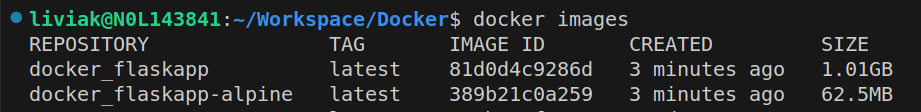

# Docker: Multi-stage Build
Este projeto oferece um exemplo prático voltado para cenários de produção com restrições de espaço em disco. Além disso, apresenta boas práticas na criação de ambientes de produção eficientes. A abordagem principal adotada é o uso de builds de múltiplos estágios (Multi-stage builds) para otimizar ambientes de produção derivados de contêineres Docker, resultando em imagens com tamanhos significativamente reduzidos.

## Tabela de Conteúdos
- [Instalação](#instalação)
- [Uso](#uso)
- [Estrutura do Projeto](#estrutura-do-projeto)


## Instalação
### Pré-requisitos
Para garantir o correto funcionamento do projeto, é imprescindível que o **Docker** e o **Docker Compose** estejam instalados em sua máquina.

### Comando de instalação
```bash
# Clone o repositório
git clone https://github.com/LiviaKarolayne/Docker.git

# Mude para o diretório do repositório
cd Docker
```

## Uso
Aqui está um exemplo básico de como utilizar este projeto:

```bash
# Mude para o diretório do projeto
cd multi-stage-build

# Execute o build das imagens
dodocker-compose build

# Verifique o tamanho de cada imagem
docker images
```
#### Resultado esperado
Neste exemplo, foram geradas duas imagens Docker: uma seguindo uma abordagem tradicional e outra otimizada utilizando o Multi-stage build. Desse modo, destaca-se uma economia de espaço notável, alcançando uma redução de 94% no tamanho da imagem otimizada em comparação com a abordagem convencional.



## Estrutura do Projeto
O projeto segue uma estrutura de diretórios simples, organizando os principais artefatos e arquivos da seguinte forma:
```text
├── multi-stage-build/
│   ├── app.py
│   ├── doc/
│   │   └── docker_image_list.jpeg
│   ├── docker-compose.yml
│   ├── Dockerfile
│   ├── Dockerfile-multi-stage-build
│   ├── README.md
│   └── requirements.txt
```

#### Explicação dos Diretórios
- `multi-stage-build/`: Contém o código-fonte principal do projeto
  - `doc/`: Documentação adicional sobre o projeto.
  - `app.py`: Contém o código-fonte principal de uma aplicação mínima em Flask.
  - `docker-compose.yml`: Arquivo de configuração do Docker Compose, usado para definir as imagens docker.
  - `Dockerfile`: Dockerfile simples que implementa uma abordagem tradicional para criação de uma imagem para ambientes de produção.
  - `Dockerfile-multi-stage-build`: Dockerfile adicional que implementa uma abordagem de "multi-stage build", visando a criação de uma imagem otimizada para ambientes de produção.
  - `README.md`: Este arquivo fornece uma visão geral do projeto, instruções e informações importantes.
  - `requirements.txt`: Arquivo que lista as dependências necessárias para a aplicação mínima em Flask.

