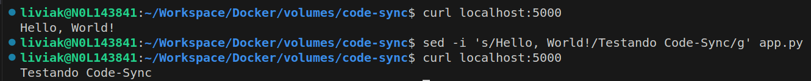

# Docker: Código Sincronizado
Este projeto fornece um exemplo prático da utilização de volumes Docker com o objetivo de otmizar o desenvolvimento e a entrega de aplicações em containers.

Diferenciando-se da abordagem convencional de persistência de dados, a técnica adotada neste projeto utiliza os volumes Docker de forma estratégica para realizar a sincronização em tempo real de aplicações no interior do container, eliminando a necessidade de reconstruir a imagem a cada atualização de código.

Esse método não apenas reduz o tempo de desenvolvimento, mas também estabelece um ambiente isolado e estável, promovendo uma abordagem contínua no ciclo de desenvolvimento e entrega de aplicações.

## Tabela de Conteúdos
- [Instalação](#instalação)
- [Uso](#uso)
- [Estrutura do Projeto](#estrutura-do-projeto)


## Instalação
### Pré-requisitos
Para garantir o correto funcionamento do projeto, é imprescindível que o **Docker** e o **Docker Compose** estejam instalados em sua máquina.

### Comando de instalação
```bash
# Clone o repositório
git clone https://github.com/LiviaKarolayne/Docker.git

# Mude para o diretório do repositório
cd Docker
```

## Uso
Aqui está um exemplo básico de como utilizar este projeto:

```bash
# Mude para o diretório do projeto
cd volumes/code-sync

# Execute a inicialização do ambiente Compose 
docker-compose up -d

# Envie uma requisição à aplicação
curl localhost:5000

# Modifique o conteúdo da aplicação
sed -i 's/Hello, World!/Testando Code-Sync/g' app.py

# Certifique-se de que a alteração foi aplicada
curl localhost:5000
```
#### Resultado esperado
Neste exemplo, após a inicialização do ambiente Compose no qual a aplicação está hospedada, ao realizar a primeira requisição, foi obtido o trecho original contendo a mensagem "Hello, World!". Com as modificações no código, a aplicação foi atualizada internamente no container, passando a responder com "Testando Code-Sync" para mesma requisição.



## Estrutura do Projeto
O projeto segue uma estrutura de diretórios simples, organizando os principais artefatos e arquivos da seguinte forma:
```text
├── doc/
├── app.py
├── docker-compose.yml
├── Dockerfile
├── README.md
└── requirements.txt
└── requirements.txt
```

#### Explicação dos Diretórios
- `doc/`: Documentação adicional sobre o projeto.
- `app.py`: Contém o código-fonte principal de uma aplicação mínima em Flask.
- `docker-compose.yml`: Arquivo de configuração do Docker Compose, usado para definir as imagens docker.
- `Dockerfile`: Dockerfile simples para criação de uma imagem destinadas a ambientes de produção.
- `README.md`: Este arquivo fornece uma visão geral do projeto, instruções e informações importantes.
- `requirements.txt`: Arquivo que lista as dependências necessárias para a aplicação mínima em Flask.


